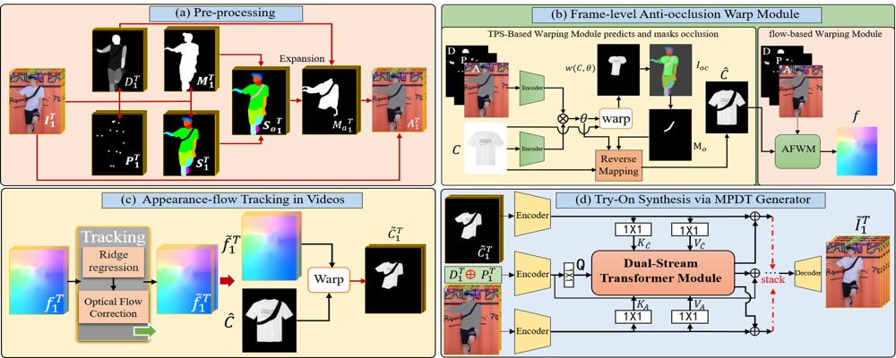

# ClothFormer: Taming Video Virtual Try-on in All Module(CVPR 2022 Oral)


[paper](https://arxiv.org/abs/2204.12151) | [project](https://cloth-former.github.io/)

In order to reduce the project size, we put all videos of paper's figures on [google drive](https://drive.google.com/drive/folders/1lCQTB_8rKXfe-lhq9eUc8KVXo_cHqox9?usp=sharing).


## Introduction
<div align="center">
  
</div>
Framework of ClothFormer. (a) First, we obtain clothing-agnostic person image sequences. (b) We predict t warped clothes by TPS-based warp method to infer an anti-occlusion target clothes, then appearance-flow-based warp method is adopted to get an appearance flow. (c) Appearance-flow tracking module based on ridge regression and optical flow correction is designed to get warped clothing sequence with spatio-temporally consistent. (d) Finally, MPDT generator synthesizes the final output video sequence based on the outputs from the previous stages.


## Results
#### Results on iQIYI-VVT
<p align='center'>  
    
</p>

#### Results on VVT
<p align='center'>  
    
</p>


## Citation

```
@inproceedings{jiang2022clothformer,
    title={ClothFormer: Taming Video Virtual Try-on in All Module},
    author={Jianbin Jiang and Tan Wang and He Yan and Junhui Liu},
    booktitle={Proceedings of the IEEE Conference on Computer Vision and Pattern Recognition (CVPR)},
    year={2022}
}
```


